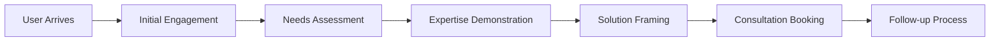

# Product Requirements Document (PRD)
## Ram Senthil-Maree Digital Twin Consultancy Platform

**Document Version**: 1.0  
**Date**: January 7, 2025  
**Product Owner**: Ram Senthil-Maree  
**Technical Architect**: Claude AI  
**Project Code**: RSDT-2025  

---

## 1. Executive Summary

### 1.1 Product Vision
**Primary Goal**: Create a sophisticated AI-powered digital twin that demonstrates Ram Senthil-Maree's digital transformation expertise while generating qualified consulting leads.

**Core Value Proposition**: 
- Showcase advanced RAG implementation capabilities to potential clients
- Provide intelligent consultancy advice through multi-agent AI system
- Generate qualified leads with 70%+ contact capture rate
- Demonstrate thought leadership in AI-driven business transformation

### 1.2 Success Metrics
| Metric Category | Target KPI | Measurement Method |
|----------------|------------|-------------------|
| **Lead Generation** | 70% contact capture rate | Firebase Analytics tracking |
| **Engagement Quality** | 5+ minute average session | Session duration monitoring |
| **Lead Qualification** | 40% of contacts → qualified leads | CRM conversion tracking |
| **Business Conversion** | 30% qualified leads → meetings | Calendar booking analytics |
| **Technical Demonstration** | 80% "impressive" feedback | User feedback surveys |
| **User Retention** | 60% returning visitors | Visitor ID tracking |

### 1.3 Target Users (Phase 1: 10-20 Initial Users)
- **Primary (40%)**: Housing association executives and digital directors
- **Secondary (30%)**: Public sector transformation leads and PMO directors  
- **Tertiary (30%)**: Microsoft Dynamics partners and consultancy prospects

---

## 2. Product Overview

### 2.1 Core Functionality
The digital twin will function as an intelligent consultancy advisor that:

1. **Engages in sophisticated consultative conversations** using Ram's methodology
2. **Demonstrates deep expertise** through contextual knowledge retrieval
3. **Provides specific, actionable insights** based on Ram's experience
4. **Guides prospects toward consultation engagement** naturally
5. **Expands knowledge base automatically** through research agents

### 2.2 Technology Architecture
```
Frontend: Streamlit (Professional chat interface)
Orchestration: MCP Agent Framework (Multi-agent system)
Backend: Firebase (Firestore + Cloud Functions)
AI/ML: Gemini 2.0 Flash (Primary LLM)
Vector DB: Pinecone (Knowledge base storage)
Deployment: Google Cloud Run
```

### 2.3 Core User Journey


---

## 3. Functional Requirements

### 3.1 Agent System Requirements

#### 3.1.1 ConsultancyAgent (Primary Orchestrator)
**Purpose**: Main conversation coordinator implementing Ram's consultative methodology

**Functional Requirements**:
- **FR-CA-001**: Analyze conversation context and determine appropriate engagement stage
- **FR-CA-002**: Maintain conversation flow across multiple interactions
- **FR-CA-003**: Apply Ram's strategic questioning methodology
- **FR-CA-004**: Coordinate handoffs to specialized agents when needed
- **FR-CA-005**: Manage transition from advice to sales naturally

**Input/Output Specifications**:
- **Input**: User message, conversation context, engagement history
- **Output**: Contextual response, updated engagement stage, lead scoring data

#### 3.1.2 ExpertiseAgent (Knowledge Retrieval)
**Purpose**: Access and present Ram's experience base and methodologies

**Functional Requirements**:
- **FR-EA-001**: Search Ram's experience base using semantic vector search
- **FR-EA-002**: Retrieve relevant case studies and methodologies
- **FR-EA-003**: Format responses with specific experience context
- **FR-EA-004**: Provide industry-specific insights and benchmarking
- **FR-EA-005**: Reference specific past projects and outcomes

**Knowledge Base Structure**:
```
Namespaces:
├── experiences/ (Career history: Newlon, FDM, EE, Inmarsat)
├── methodologies/ (Transformation frameworks)  
├── industries/ (Sector-specific insights)
├── tools/ (Technology expertise: Dynamics, PMO)
└── case_studies/ (Client success stories)
```

#### 3.1.3 EngagementAgent (Lead Conversion)
**Purpose**: Handle consultation booking and lead qualification

**Functional Requirements**:
- **FR-EG-001**: Identify optimal moments for engagement transition
- **FR-EG-002**: Qualify leads using BANT methodology (Budget, Authority, Need, Timeline)
- **FR-EG-003**: Integrate with calendar system for meeting booking
- **FR-EG-004**: Capture contact information with consent
- **FR-EG-005**: Send automated follow-up communications

#### 3.1.4 AssessmentAgent (Phase 2 - Diagnostic)
**Purpose**: Conduct structured assessments of transformation challenges

**Functional Requirements**:
- **FR-AA-001**: Generate diagnostic questions based on domain expertise
- **FR-AA-002**: Analyze organizational maturity levels
- **FR-AA-003**: Identify transformation readiness factors
- **FR-AA-004**: Provide structured assessment reports

#### 3.1.5 ResearchAgent (Phase 2 - Knowledge Expansion)
**Purpose**: Automatically expand knowledge base with current insights

**Functional Requirements**:
- **FR-RA-001**: Monitor industry trends and developments
- **FR-RA-002**: Generate new case studies from successful interactions
- **FR-RA-003**: Research competitor methodologies and positioning
- **FR-RA-004**: Update knowledge base with validated insights

### 3.2 Knowledge Management Requirements

#### 3.2.1 Initial Knowledge Base (10,000 words)
**Content Categories**:
- **Ram's Experience Repository**: Detailed career history with specific achievements
- **Transformation Methodologies**: Strategic frameworks and implementation approaches
- **Industry Expertise**: Public sector, housing, financial services insights
- **Technology Specializations**: Microsoft Dynamics 365, PMO setup, change management

#### 3.2.2 Knowledge Base Expansion
**Automated Expansion Requirements**:
- **FR-KB-001**: Weekly industry trend analysis and integration
- **FR-KB-002**: Quarterly methodology updates based on new case studies
- **FR-KB-003**: Real-time competitive intelligence gathering
- **FR-KB-004**: Quality validation of auto-generated content

### 3.3 User Interface Requirements

#### 3.3.1 Chat Interface
**Functional Requirements**:
- **FR-UI-001**: Professional, branded chat interface with Ram's personal branding
- **FR-UI-002**: Real-time typing indicators and response streaming
- **FR-UI-003**: Conversation history persistence across sessions
- **FR-UI-004**: Mobile-responsive design for various devices
- **FR-UI-005**: Accessibility compliance (WCAG 2.1 AA)

#### 3.3.2 User Experience Flow
**FR-UX-001**: Anonymous usage initially, optional registration for enhanced experience
**FR-UX-002**: Progressive disclosure of Ram's expertise through conversation
**FR-UX-003**: Natural transition points for deeper engagement
**FR-UX-004**: Clear value proposition communication throughout interaction

### 3.4 Data Management Requirements

#### 3.4.1 Conversation Data
**FR-DATA-001**: Store conversation history with proper anonymization
**FR-DATA-002**: Track engagement metrics and user behavior analytics
**FR-DATA-003**: Maintain lead scoring data with qualification criteria
**FR-DATA-004**: Ensure GDPR compliance for all personal data handling

#### 3.4.2 Lead Management
**FR-LEAD-001**: Capture leads with explicit consent and clear value exchange
**FR-LEAD-002**: Integrate with CRM system for follow-up management
**FR-LEAD-003**: Automated lead scoring based on conversation analysis
**FR-LEAD-004**: Meeting booking integration with calendar systems

---

## 4. Non-Functional Requirements

### 4.1 Performance Requirements
| Requirement | Target | Measurement |
|-------------|--------|-------------|
| **Response Time - Simple Queries** | <2 seconds | 95th percentile |
| **Response Time - Complex Workflows** | <8 seconds | 95th percentile |
| **Response Time - Research Queries** | <15 seconds | 95th percentile |
| **Concurrent Users** | 20+ simultaneous | Load testing validation |
| **System Uptime** | 99.5% availability | Monthly monitoring |

### 4.2 Scalability Requirements
- **NFR-SCALE-001**: Support 200-500 conversations per month initially
- **NFR-SCALE-002**: Auto-scale to handle traffic spikes (5x normal load)
- **NFR-SCALE-003**: Database performance optimization for growing conversation history
- **NFR-SCALE-004**: CDN integration for global response time optimization

### 4.3 Security Requirements
- **NFR-SEC-001**: All API communications over HTTPS/TLS 1.3
- **NFR-SEC-002**: API key management through secure credential storage
- **NFR-SEC-003**: Input validation and sanitization to prevent injection attacks
- **NFR-SEC-004**: Rate limiting to prevent abuse (100 requests/hour per IP)
- **NFR-SEC-005**: Data encryption at rest for all sensitive information

### 4.4 Reliability Requirements
- **NFR-REL-001**: Circuit breaker pattern for external API dependencies
- **NFR-REL-002**: Graceful degradation when MCP agents fail
- **NFR-REL-003**: Automated health checks and alerting
- **NFR-REL-004**: Backup and disaster recovery procedures

---

## 5. Technical Specifications

### 5.1 MCP Agent Framework Integration
```python
# Core Agent Configuration
agent_config = {
    "consultancy_agent": {
        "model": "gemini-2.0-flash",
        "temperature": 0.7,
        "max_tokens": 2000,
        "mcp_servers": ["knowledge_server", "lead_server"]
    },
    "expertise_agent": {
        "model": "gemini-2.0-flash", 
        "temperature": 0.3,
        "max_tokens": 3000,
        "mcp_servers": ["knowledge_server", "research_server"]
    }
}
```

### 5.2 Firebase Integration Specifications
```javascript
// Firestore Collections Structure
collections = {
    "conversations": {
        "conversationId": "string",
        "userId": "string",
        "status": "enum[active|completed|converted]",
        "leadScore": "number[0-100]",
        "context": "object",
        "messages": "array",
        "analytics": "object"
    },
    "leads": {
        "leadId": "string",
        "conversationId": "reference",
        "qualification": "object",
        "contactInfo": "object",
        "status": "enum[new|qualified|meeting_set|converted]"
    }
}
```

### 5.3 API Specifications

#### 5.3.1 Chat API Endpoint
```
POST /api/chat
Content-Type: application/json

Request Body:
{
    "message": "string",
    "conversationId": "string|null",
    "context": {
        "userType": "string",
        "sessionData": "object"
    }
}

Response:
{
    "response": "string",
    "conversationId": "string", 
    "engagementStage": "string",
    "leadScore": "number",
    "suggestedActions": "array"
}
```

#### 5.3.2 Lead Capture API
```
POST /api/lead/capture
Content-Type: application/json

Request Body:
{
    "conversationId": "string",
    "contactInfo": {
        "name": "string",
        "email": "string",
        "company": "string",
        "role": "string"
    },
    "consent": "boolean"
}
```

---

## 6. Integration Requirements

### 6.1 External System Integrations

#### 6.1.1 Calendar Integration (Google Calendar)
- **Purpose**: Automated meeting booking and availability checking
- **Requirements**: OAuth 2.0 integration, real-time availability updates
- **API**: Google Calendar API v3

#### 6.1.2 CRM Integration (Future Phase)
- **Purpose**: Lead management and follow-up automation
- **Options**: HubSpot, Salesforce, or custom CRM
- **Requirements**: Bidirectional data sync, automated lead scoring

#### 6.1.3 Research APIs
- **Google Search API**: Industry trend monitoring
- **LinkedIn API**: Company research and contact validation
- **News APIs**: Real-time industry developments

### 6.2 Analytics and Monitoring
- **Google Analytics 4**: User behavior tracking
- **Google Cloud Monitoring**: System performance metrics
- **Custom Dashboard**: Business KPI visualization

---

## 7. Compliance and Legal Requirements

### 7.1 Data Protection (GDPR)
- **Requirement**: Full GDPR compliance for EU visitors
- **Implementation**: Consent management, data portability, right to deletion
- **Documentation**: Privacy policy, cookie policy, data processing agreements

### 7.2 Accessibility
- **Standard**: WCAG 2.1 AA compliance
- **Features**: Screen reader compatibility, keyboard navigation, high contrast support

### 7.3 Terms of Service
- **Usage Rights**: Clear terms for AI interaction and data usage
- **Limitation of Liability**: Professional advice disclaimers
- **Intellectual Property**: Protection of Ram's methodologies and content

---

## 8. Success Criteria and Acceptance Testing

### 8.1 Phase 1 Acceptance Criteria (4 weeks)
- ✅ **Core agents operational**: ConsultancyAgent, ExpertiseAgent, EngagementAgent
- ✅ **Response time targets met**: <2s simple, <8s complex queries
- ✅ **Lead capture functional**: 70% contact capture rate in beta testing
- ✅ **Knowledge base integrated**: 95% query coverage from Ram's experience
- ✅ **Firebase deployment successful**: Production-ready environment

### 8.2 Phase 2 Acceptance Criteria (8 weeks)
- ✅ **Multi-agent orchestration**: Parallel workflows operational
- ✅ **Calendar integration**: Automated meeting booking functional
- ✅ **Enhanced analytics**: Comprehensive performance dashboard
- ✅ **Load testing passed**: 20+ concurrent users supported

### 8.3 Phase 3 Acceptance Criteria (12 weeks)  
- ✅ **Research agent operational**: Automated knowledge expansion
- ✅ **Advanced analytics**: Business intelligence reporting
- ✅ **ROI targets met**: £150,000+ annual pipeline generated
- ✅ **System optimization**: 99.5% uptime achieved

---

## 9. Risk Management

### 9.1 Technical Risks
| Risk | Impact | Probability | Mitigation Strategy |
|------|--------|-------------|-------------------|
| **MCP Protocol Changes** | High | Medium | Version locking, adapter patterns |
| **LLM API Failures** | Medium | Low | Fallback mechanisms, multiple providers |
| **Performance Degradation** | Medium | Medium | Load testing, auto-scaling |
| **Security Vulnerabilities** | High | Low | Regular security audits, penetration testing |

### 9.2 Business Risks
| Risk | Impact | Probability | Mitigation Strategy |
|------|--------|-------------|-------------------|
| **Low User Adoption** | High | Medium | Beta testing, user feedback integration |
| **Poor Lead Quality** | Medium | Medium | Lead scoring optimization, qualification improvement |
| **Competitive Response** | Low | High | Continuous innovation, unique methodology focus |

---

## 10. Project Timeline and Milestones

### 10.1 Phase 1: MVP (Weeks 1-4)
- **Week 1**: Development environment setup, MCP agent framework integration
- **Week 2**: Core agent development (Consultancy, Expertise, Engagement)
- **Week 3**: Firebase integration, Streamlit frontend development
- **Week 4**: Testing, deployment, beta user validation

### 10.2 Phase 2: Enhancement (Weeks 5-8)  
- **Week 5**: Multi-agent orchestration, parallel workflows
- **Week 6**: Calendar integration, advanced lead management
- **Week 7**: Analytics dashboard, performance optimization
- **Week 8**: Public launch, user onboarding

### 10.3 Phase 3: Advanced Features (Weeks 9-12)
- **Week 9**: Research agent development, knowledge expansion
- **Week 10**: Advanced analytics, business intelligence
- **Week 11**: System optimization, security hardening
- **Week 12**: Full deployment, marketing launch

---

## 11. Budget and Resource Allocation

### 11.1 Development Costs
- **Phase 1**: £2,000 (setup, core development)
- **Phase 2**: £3,000 (enhancement, integrations)
- **Phase 3**: £2,000 (optimization, advanced features)
- **Total Development**: £7,000

### 11.2 Operational Costs (Monthly)
- **Gemini 2.0 Flash API**: £150-300
- **Firebase Hosting**: £20-50
- **Firestore Database**: £30-80
- **Cloud Functions**: £20-40
- **Pinecone Vector DB**: £50-100
- **Total Monthly**: £270-570

### 11.3 ROI Projections
- **Year 1 Pipeline Target**: £150,000
- **Investment Recovery**: 4-6 months
- **ROI**: 600%+ annually

---

## 12. Appendices

### 12.1 Glossary
- **MCP**: Model Context Protocol - Standard for AI agent communication
- **RAG**: Retrieval-Augmented Generation - AI technique combining retrieval and generation
- **Digital Twin**: AI representation of Ram's consultancy expertise
- **Lead Scoring**: Automated qualification of prospect value

### 12.2 Reference Documents
- Strategic Blueprint (Conversation History 04)
- Technical Architecture Analysis (Conversation History 03)
- Solution Analysis (Conversation History 02)
- Requirements Gathering (Conversation History 01)

---

**Document Status**: ✅ **APPROVED FOR IMPLEMENTATION**  
**Next Step**: Detailed Project Plan Development