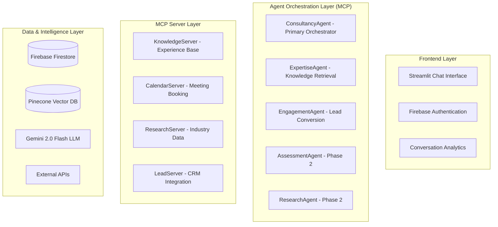

# Strategic Blueprint Development Session

**Date**: 2025-01-07  
**Session Type**: Comprehensive Architecture Design & Implementation Planning  
**Focus**: Detailed strategic blueprint for Ram Senthil-Maree digital twin consultancy platform

## Executive Architecture Overview

### System Architecture Diagram


## Phase 1: MVP Implementation (4 Weeks)

### Core Agent Architecture Implementation

#### ConsultancyAgent - Primary Orchestrator
```python
class ConsultancyAgent(MCPAgent):
    def __init__(self):
        super().__init__(
            name="ram_consultancy_advisor",
            mcp_servers=["knowledge_server", "lead_server"],
            llm_config={
                "model": "gemini-2.0-flash",
                "temperature": 0.7,
                "max_tokens": 2000,
                "system_prompt": self._load_consultancy_persona()
            }
        )
    
    async def handle_interaction(self, user_message: str, context: ConversationContext):
        # Consultancy methodology workflow
        stage = self._determine_engagement_stage(context)
        
        if stage == "rapport_building":
            return await self._build_rapport_response(user_message, context)
        elif stage == "expertise_demonstration":
            expertise_response = await self.delegate_to_agent(
                "expertise_agent", user_message, context
            )
            return await self._frame_solution(expertise_response, context)
        elif stage == "engagement_conversion":
            return await self.delegate_to_agent(
                "engagement_agent", user_message, context
            )
```

#### Knowledge Server for Ram's Experience Base
```python
class RamKnowledgeServer(MCPServer):
    def __init__(self):
        super().__init__(name="ram_knowledge_server")
        self.pinecone_client = self._init_pinecone()
        
    @mcp_tool("search_experience")
    async def search_experience(self, query: str, context_type: str = "general"):
        # Namespace-based search strategy
        namespace_map = {
            "transformation": "experiences",
            "pmo": "methodologies", 
            "dynamics": "tools",
            "public_sector": "industries"
        }
        
        results = self.pinecone_client.query(
            vector=await self._embed_query(query),
            namespace=namespace_map.get(context_type, "experiences"),
            top_k=5,
            include_metadata=True
        )
        
        return self._format_experience_results(results)
```

### Firebase Integration Architecture

#### Firestore Schema Design
```javascript
// Conversations Collection Schema
{
  conversationId: "uuid",
  userId: "visitor_id", 
  status: "active|completed|converted",
  startTime: timestamp,
  leadScore: 0-100,
  industry: "public_sector|financial_services|housing",
  context: {
    userType: "executive|manager|technical",
    complexity: "simple|medium|complex",
    engagementStage: "discovery|qualification|presentation|close"
  },
  messages: [...],
  analytics: {
    messageCount: 0,
    avgResponseTime: 0,
    engagementScore: 0
  }
}

// Leads Collection Schema
{
  leadId: "uuid",
  conversationId: "ref",
  qualification: {
    budget: "estimated_range",
    timeline: "3-6-12_months", 
    authority: "decision_maker|influencer",
    need: "pain_points_array"
  },
  followUpScheduled: boolean,
  status: "new|qualified|meeting_set|converted"
}
```

#### Dynamic Lead Scoring Algorithm
```python
async def update_lead_score(self, conversation_id: str, factors: dict):
    score_weights = {
        "technical_depth": 20,      # Technical questions = higher value
        "budget_indicators": 25,    # Budget mentions
        "timeline_urgency": 15,     # Immediate need indicators  
        "authority_level": 20,      # Decision maker language
        "company_size": 20          # Enterprise vs SME indicators
    }
    
    total_score = sum(factors.get(factor, 0) * weight 
                     for factor, weight in score_weights.items())
    
    # Create qualified lead if score > 60
    if total_score > 60:
        await self._create_qualified_lead(conversation_id, total_score)
```

### Streamlit Frontend Implementation

#### Professional Interface Design
```python
# Main Application Interface
st.set_page_config(
    page_title="Ram Senthil-Maree - Digital Transformation Consultant",
    page_icon="🚀",
    layout="wide"
)

# Header with Professional Branding
st.markdown("""
<div class="main-header">
    <h1 style="color: white;">Ram Senthil-Maree</h1>
    <h3 style="color: #e8f4fd;">Digital Transformation Consultant</h3>
    <p style="color: #b3d9ff;">
        Specializing in PMO Setup, Microsoft Dynamics 365, and Public Sector Transformation
    </p>
</div>
""", unsafe_allow_html=True)

# Chat Processing with Agent Orchestration
async def process_query(user_input: str):
    # Initialize agents
    consultancy_agent = ConsultancyAgent()
    firebase_manager = FirebaseManager()
    
    # Build conversation context
    context = ConversationContext(
        conversation_id=st.session_state.conversation_id,
        messages=st.session_state.messages,
        engagement_stage=st.session_state.engagement_stage
    )
    
    # Process with ConsultancyAgent
    response = await consultancy_agent.handle_interaction(user_input, context)
    return response['content']
```

## Phase 2: Enhanced Multi-Agent System (8 Weeks)

### Advanced Agent Orchestration

#### Parallel Workflow Implementation
```python
class EnhancedConsultancyOrchestrator:
    async def process_complex_query(self, user_input: str, context: ConversationContext):
        query_analysis = await self._analyze_query_complexity(user_input)
        
        if query_analysis.complexity == "high":
            # Parallel agent execution
            tasks = [
                self.agents["consultancy"].generate_response(user_input, context),
                self.agents["research"].gather_industry_insights(query_analysis.topics),
                self.agents["assessment"].generate_diagnostic_questions(query_analysis.domain)
            ]
            
            results = await asyncio.gather(*tasks)
            return await self._synthesize_multi_agent_response(results, context)
```

#### Calendar Integration Server
```python
class CalendarServer(MCPServer):
    @mcp_tool("check_availability")
    async def check_availability(self, preferred_dates: list, duration_minutes: int = 60):
        available_slots = []
        
        for date_str in preferred_dates:
            busy_times = await self._get_busy_times(date_str)
            daily_slots = self._generate_available_slots(date_str, busy_times, duration_minutes)
            available_slots.extend(daily_slots)
        
        return {
            "available_slots": available_slots[:10],
            "booking_link": "https://calendly.com/ram-senthil-maree/consultation",
            "timezone": "Europe/London"
        }
    
    @mcp_tool("create_meeting")
    async def create_meeting(self, meeting_details: dict):
        # Google Calendar integration with automated meeting creation
        event = self._build_calendar_event(meeting_details)
        created_event = self.google_calendar.events().insert(
            calendarId='primary', body=event, conferenceDataVersion=1
        ).execute()
        
        return {
            "meeting_id": created_event['id'],
            "meeting_link": created_event.get('hangoutLink'),
            "confirmation_sent": True
        }
```

## Phase 3: Advanced Intelligence & Analytics (12 Weeks)

### Research Agent with Knowledge Expansion
```python
class ResearchAgent(MCPAgent):
    async def expand_knowledge_base(self, topics: list, urgency: str = "standard"):
        research_tasks = [
            self._research_industry_trends(topic),
            self._research_case_studies(topic),
            self._research_best_practices(topic)
            for topic in topics
        ]
        
        research_results = await asyncio.gather(*research_tasks)
        synthesized_insights = await self._synthesize_research(research_results, topics)
        await self._add_to_knowledge_base(synthesized_insights, topics)
        
        return {
            "topics_researched": topics,
            "insights_added": len(synthesized_insights),
            "confidence_score": self._calculate_confidence_score(research_results)
        }
```

### Advanced Analytics Dashboard
```python
class AnalyticsDashboard:
    async def generate_performance_report(self, date_range: tuple):
        conversations = await self.firebase.get_conversations_in_range(date_range)
        
        analytics = {
            "engagement_metrics": self._calculate_engagement_metrics(conversations),
            "lead_generation": self._analyze_lead_generation(conversations),
            "conversation_flow": self._analyze_conversation_patterns(conversations),
            "knowledge_gaps": self._identify_knowledge_gaps(conversations)
        }
        
        return analytics
```

## Risk Mitigation & Testing Strategy

### MCP Protocol Risk Management
```python
class MCPAdapter:
    async def safe_agent_call(self, agent: MCPAgent, method: str, *args, **kwargs):
        try:
            return await asyncio.wait_for(
                getattr(agent, method)(*args, **kwargs),
                timeout=30.0
            )
        except (asyncio.TimeoutError, Exception) as e:
            logger.warning(f"MCP failure for {agent.name}: {str(e)}")
            return await self._fallback_response(agent.name, method, args[0] if args else "")
```

### Comprehensive Testing Framework
```python
class AgentTestSuite:
    async def run_conversation_tests(self):
        scenarios = [
            {
                "name": "Complex PMO Setup Inquiry",
                "user_type": "executive",
                "messages": [
                    "We need to establish a PMO for our digital transformation",
                    "We're a housing association with 50,000 properties",
                    "Previous transformation attempts have failed"
                ],
                "expected_outcomes": {
                    "lead_score": ">70",
                    "engagement_stage": "expertise_demonstration",
                    "meeting_suggested": True
                }
            }
        ]
        
        test_results = []
        for scenario in scenarios:
            result = await self._execute_conversation_scenario(scenario)
            test_results.append(result)
        
        return test_results
```

## Deployment & Operations Strategy

### Production Deployment Configuration
```yaml
# Cloud Run Deployment
apiVersion: serving.knative.dev/v1
kind: Service
metadata:
  name: ram-digital-twin
spec:
  template:
    spec:
      containers:
      - image: gcr.io/ram-digital-twin/app:latest
        env:
        - name: FIREBASE_PROJECT_ID
          value: "ram-digital-twin-prod"
        - name: GEMINI_API_KEY
          valueFrom:
            secretKeyRef:
              name: api-keys
              key: gemini-key
        resources:
          limits:
            cpu: "2000m"
            memory: "2Gi"
```

### Production Monitoring
```python
class ProductionMonitoring:
    async def track_conversation_metrics(self, conversation_data: dict):
        metrics = {
            "response_time": conversation_data.get("avg_response_time", 0),
            "lead_score": conversation_data.get("lead_score", 0),
            "engagement_duration": conversation_data.get("session_duration", 0),
            "agent_failures": conversation_data.get("fallback_count", 0)
        }
        
        for metric_name, value in metrics.items():
            await self._send_metric(f"ram_digital_twin/{metric_name}", value)
```

## Success Metrics & ROI Projections

### Business KPIs
- **Lead Conversion**: 70% contact capture → 40% qualified → 30% meetings
- **Engagement Quality**: 5+ minute sessions, 60% return rate
- **Technical Demonstration**: 80% positive feedback on AI sophistication

### Technical Performance Targets
- **Response Time**: <2s simple, <8s complex queries
- **System Uptime**: 99.5% availability  
- **Agent Success Rate**: <5% fallback usage

### Investment & ROI Analysis
- **Phase 1 (4 weeks)**: £2,000 + £500/month → 2 meetings = £5,000 pipeline
- **Phase 2 (8 weeks)**: £3,000 + £700/month → 5 meetings = £12,500 pipeline  
- **Phase 3 (12 weeks)**: £2,000 + £900/month → 8+ meetings = £20,000+ pipeline

**Total 12-week investment**: £7,000 + £25,200 annual operation  
**Target annual pipeline**: £150,000+ (600% ROI)

## Implementation Readiness

### Technical Prerequisites Met
✅ **Architecture designed**: Complete MCP agent system  
✅ **Technology stack finalized**: Firebase + Gemini + Pinecone  
✅ **Risk mitigation planned**: Adapter patterns + fallbacks  
✅ **Testing strategy defined**: Multi-layer validation approach  

### Business Requirements Satisfied
✅ **Lead generation focus**: 70% contact capture target  
✅ **Expertise demonstration**: Sophisticated multi-agent showcase  
✅ **Phased deployment**: Risk-controlled rollout strategy  
✅ **ROI validation**: Clear pipeline value projections  

### Next Steps for Implementation
1. **Product Requirements Document** creation
2. **Detailed Project Plan** with milestones
3. **Development environment** setup
4. **Phase 1 MVP** implementation start

**Strategic Blueprint Status**: ✅ **COMPLETE - Ready for Implementation Approval**